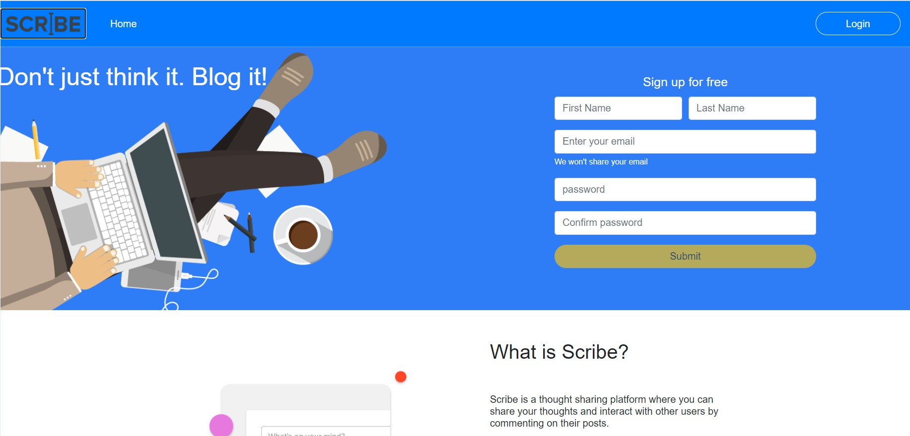
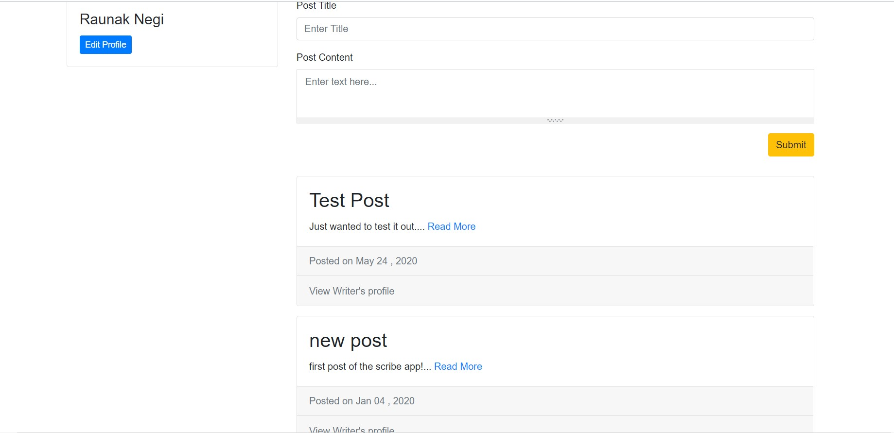
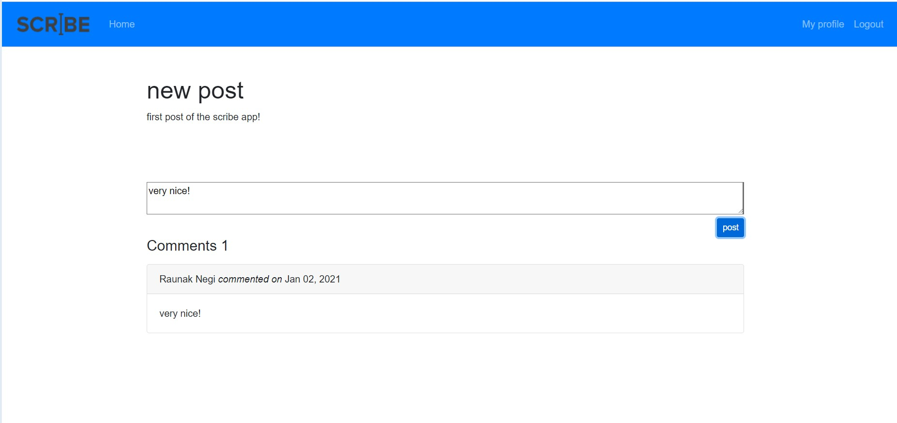

# Scribe

This app allows the authenticated user to post his/her views, opinions, etc on anything publicly. The user can also view the author's profile and comment on the posts that they are interested in.

The frontend was handled using Angular 2+ and the backend was handled by Firebase API.

Some of the images from the website

#### Home Page

#### Post Page(All Posts are visible)

#### Comment page

